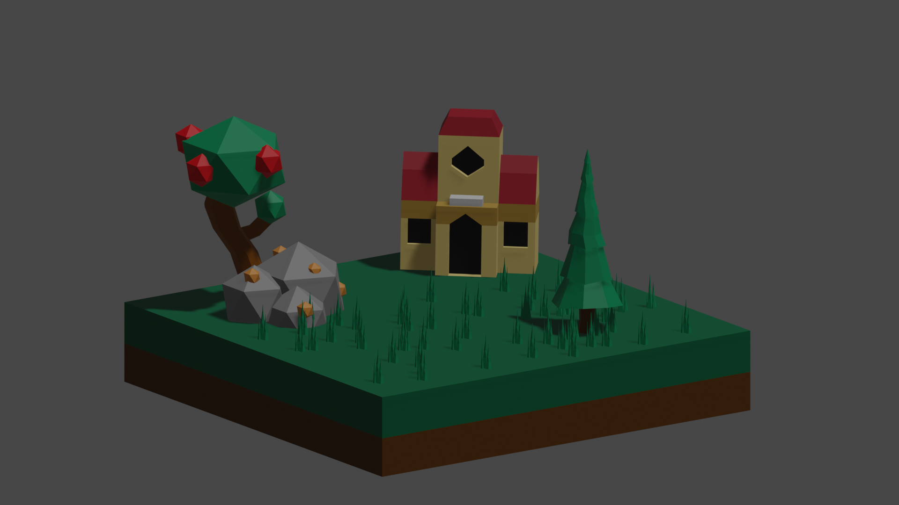
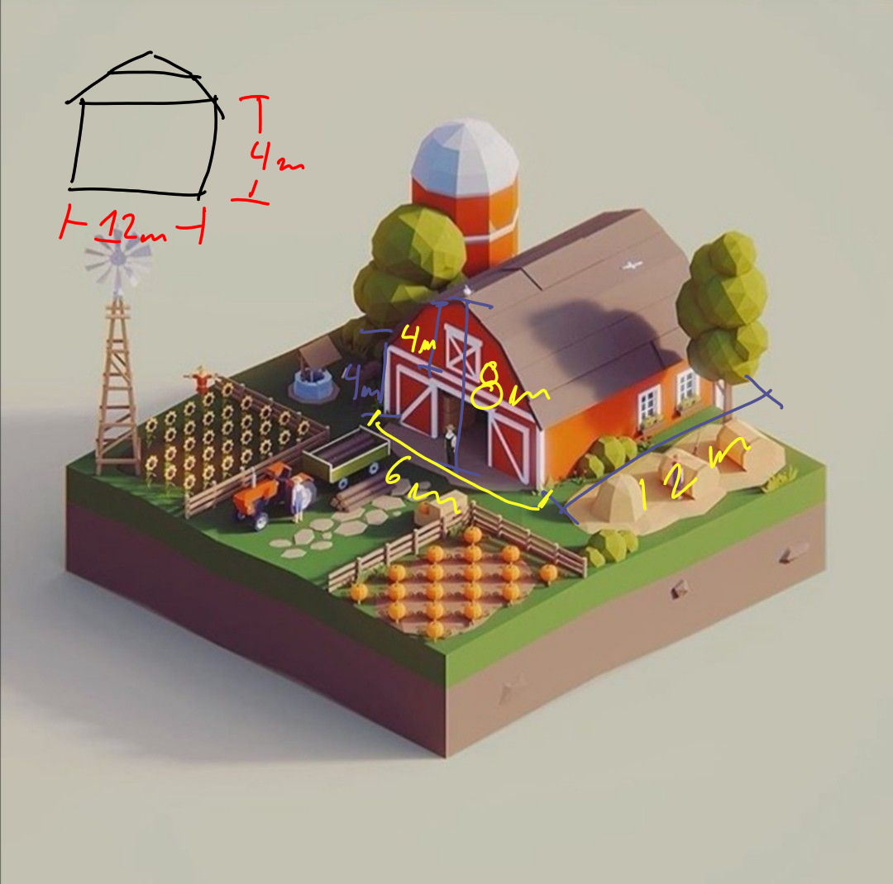
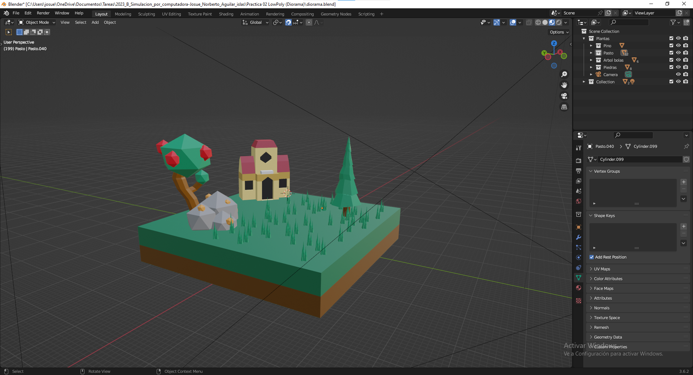
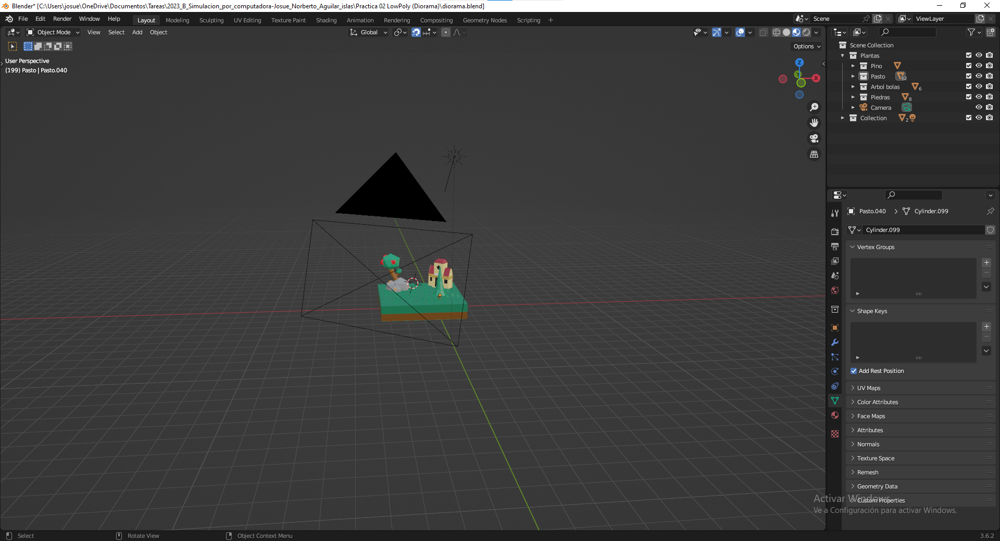
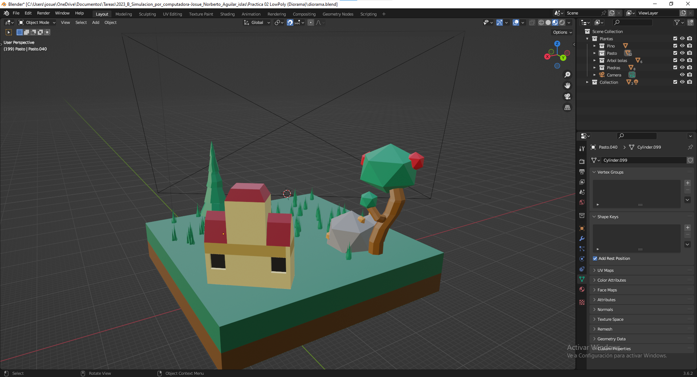

# Practica 02
***
**Autor: Josue Norberto Aguilar Islas**

***
## Introducción
Para la realización de esta actividad se usó como referencia los siguientes modelos para tener obtener ideas de como realizar la granaja, la cual fue mi idea principal.

***
## Area de trabajo

***
### Referencias
- creavideojuegos. (2023, 9 septiembre). Conceptos básicos de Blender 3.6 [Vídeo]. YouTube. https://www.youtube.com/watch?v=32aGHRQkLk8
