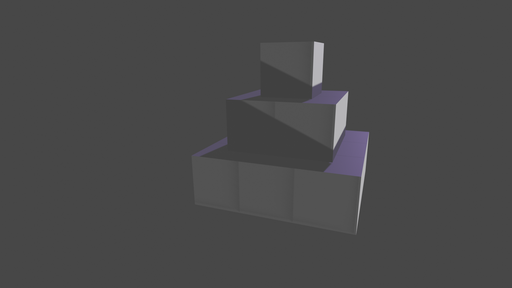
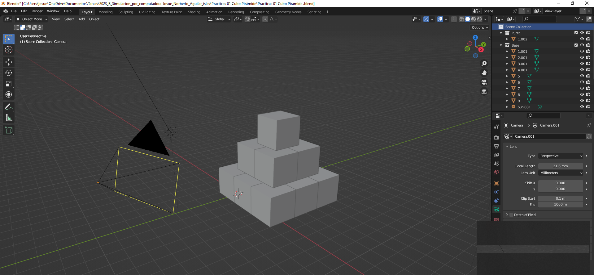

# Practicas 01 Cubo Pirámide
***
**Autor: Josue Norberto Aguilar Islas**

***
## Introducción
Para la realización de esta actividad se usó como referencia el siguiente modelo, el cual se compone de 14 puntos, esto debido a que se utilizaron 14 cubos. Cada cubo fue colocado en las coordenadas indicadas por el modelo.

***
## Area de trabajo

***
### Referencias
- creavideojuegos. (2023, 9 septiembre). Conceptos básicos de Blender 3.6 [Vídeo]. YouTube. https://www.youtube.com/watch?v=32aGHRQkLk8
